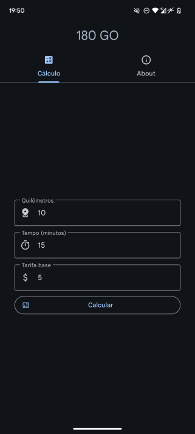
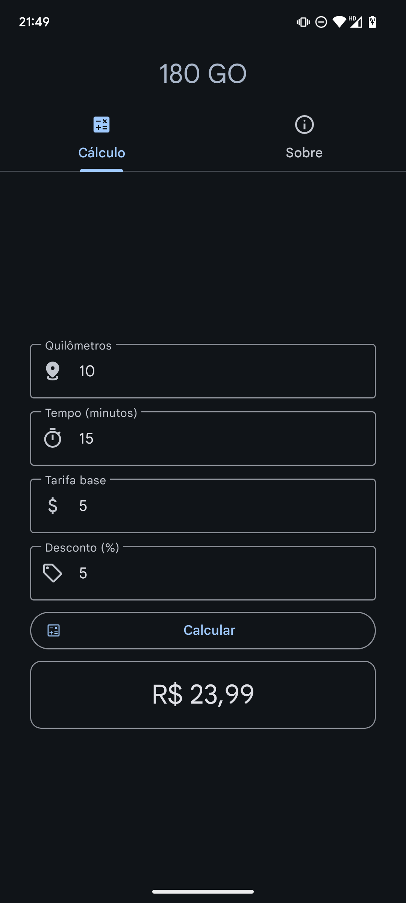
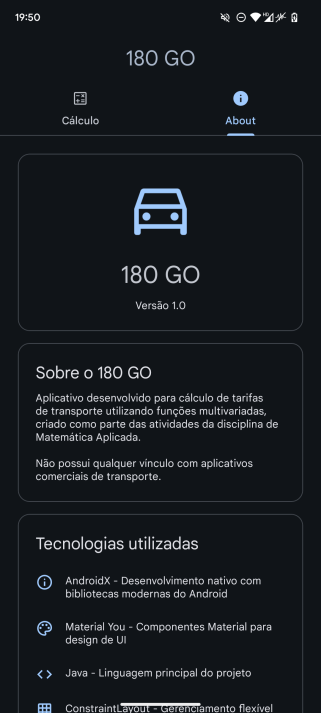

# 180 GO - Calculadora de Tarifas (Calma o coração, 99!)


Aplicativo **Android** para cálculo de tarifas de transporte usando funções matemáticas, desenvolvido com:

- **Material Design 3** (Material You)
- **Navigation Components**
- **View Binding**
- **ViewModel** e **LiveData** (com **Lifecycle**)
- **Dependabot** para atualizações automáticas

[](LICENSE)

---

## 1. Introdução

### 1.1. Screenshots
| Tela de cálculo | Resultado | Sobre |
|-----------------|-----------|---------------|
|  |  |  |

---

## 2. Intuito & Motivação
Projeto acadêmico desenvolvido para:
- Demonstrar aplicação prática de **função matemática** para cálculo de tarifa
- Explorar componentes modernos do Android
- Servir como material didático para disciplinas de:
  - Matemática Aplicada
  - Lógica de Programação
- E também, expandir meus conhecimentos em:
  - Desenvolvimento Mobile
  - Arquitetura de Software

---

## 3. Como clonar e compilar

**Pré-requisitos:**
- Android Studio Giraffe+
- JDK 17
- SDK Android 36+ (Ou até inferior, se souber mexer, não é obrigatório ser SDK 36+)

```bash
git clone https://github.com/yiesko/180go.git
cd 180go
./gradlew assembleDebug
```

**Configuração recomendada:**
1. Importe o projeto no Android Studio
2. Sincronize com arquivos do Gradle
3. Execute em emulador ou dispositivo com Android 9+

---

## 4. Como assinar o APK

1. Crie um arquivo `keystore.properties` na raiz do projeto (ou renomeie o `keystore.example.properties`):
```properties
jksPath=seu/caminho/keystore.jks
jksPassword=sua_senha
jksAlias=seu_alias
jksKeyPassword=sua_senha_chave
```

2. Gere a keystore (ou `Build > Generate Signed APK`):
```bash
keytool -genkey -v -keystore minha-chave.jks -keyalg RSA -keysize 2048 -validity 10000 -alias meu-alias
```

3. Build de release:
```bash
./gradlew assembleRelease
```

---

## 5. Melhorias futuras (Não significa que as farei)

| Prioridade | Feature Sugerida |
|------------|-------------------|
| Baixa      | Histórico de cálculos com Room DB |
| Baixa      | Gráficos de variação de preços |
| Média      | Integração com API de mapas (Preferencialmente open-source e que não seja tão pesado) |

---

## 6. Comparação de Tarifas
O aplicativo foi ajustado na atualização 1.1.0 para oferecer tarifas competitivas em relação a Uber e 99. Veja a tabela abaixo com exemplos reais (valores estimados para abril de 2025):

| **Rota**                             | **Distância (km)** | **Tempo (min)** | **180GO Original (R$)** | **Uber (R$)** | **99 (R$)** | **180GO Ajustado e sem Desconto (R$)** | **180GO Ajustado e com Desconto de 5% (R$)** |
|--------------------------------------|--------------------|-----------------|-------------------------|---------------|-------------|----------------------------------------|----------------------------------------------|
| UNINASSAU - Jóquei, Av. Jóquei Clube | 8,5                | 18              | 31,00                   | 28,20         | 24,50       | 24,05                                  | 22,85                                        |

---

## 7. Como contribuir

1. Faça um **fork** do projeto
2. Crie uma branch:  
   `git checkout -b feat/nova-feature`
3. Siga as recomendações:
    - Nomes de recursos em inglês (e traduza as strings para inglês)
    - Padrão `fragment_[nome]_[elemento]` para IDs
    - Commits semânticos e assinados
4. Abra um **Pull Request** (PR)

**Diretrizes:**
- Mantenha compatibilidade com API 28+
- Documente novas features na mensagem do commit

---

Totalmente desenvolvido por **yieskoW** | **Licença:** [MIT](LICENSE) - Uso livre para fins educacionais e comerciais